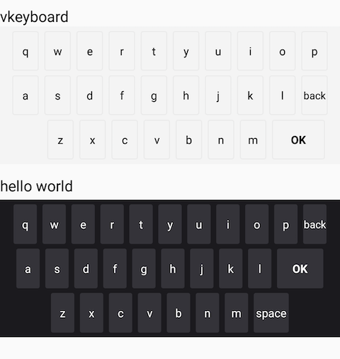

# Android AboutView

推荐下载源代码并`Import Module...`

`app` 模块存放着一些示例代码

`FisherView` 模块中存放着一些自定义View

## 分支说明

* 主分支 `master`
* 开发分支以 `dev` 开头

## 虚拟键盘
VKeyboard - Virtual keyboard

将「按键」装配到键盘上。采用适配器模式，将View添加到ViewGroup中。

VKey代表按键，VKeyboardBody代表键盘，VRow代表键盘上的一行，VKeyboardListener是监听器。
VKeyboard继承Framelayout，创建适配器VKeyboard.Adapter，将「按键」装配到键盘上。

